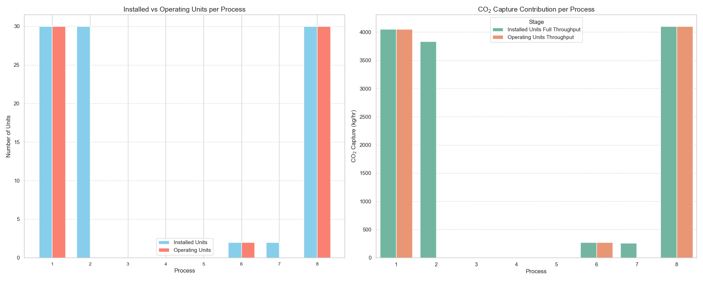

# CO2-capture-process-plainning

## Selection version 1
Use Bender decomposition to do process selection.  
Master problem: Minimizing the lower bond ($\theta$)  
Subproblem: Minimizing overall selected process cost, including capital cost, operating cost, carbon permit, land use.

## Selection version 2
Use Bender decomposition to do process selection, but in this version subproblem is used for feasibility test.  
Master problem: Minimizing overall selected process cost.  
Subproblem: Evaluating the feasibility via increasing 10% and reducing 5% of processes' CO₂ capture throughput.

## Selection version 3
Do the optimization through a two-stage optimization with two different objective function.  
First stage: Minimizing overall selected process cost.  
Second stage: Basing on the selection in the first stage to decide which process and how many of it can handle the electricity uncertainty with lowest cost.

## Selection version 4
### Version 4 optimization flowchart

Do the optimization through a two-stage optimization while combining two objective functions together.  
First stage (Here-and-Now): Select the process with lowest capital cost.  
Second stage (Wait-and-see): Decide which process and how many of it should be activated when encountering the renewable electricity uncertainty, which is forecasted by Monter-Carlo model.  
  
The final result can be figured out as below:

## References
1. Shou-Feng Chang, Hsuan-Han Chiu, Han-Shu Jao, Jin Shang, Yu-Jeng Lin, Bor-Yih Yu. 2025. "Comprehensive evaluation of various CO2 capture technologies through rigorous simulation: Economic, equipment footprint, and environmental analysis" Carbon Capture Science & Technology, Volume 14. https://doi.org/10.1016/j.ccst.2024.100342.
2. Peng, Han, Songyin Li, Linjian Shangguan, Yisa Fan, and Hai Zhang. 2023. "Analysis of Wind Turbine Equipment Failure and Intelligent Operation and Maintenance Research" Sustainability 15, no. 10: 8333. https://doi.org/10.3390/su15108333
3. Ted Stathopoulos, Hatem Alrawashdeh, Ayman Al-Quraan, Bert Blocken, Aierken Dilimulati, Marius Paraschivoiu, Pragasen Pilay. 2018. "Urban wind energy: Some views on potential and challenges" Journal of Wind Engineering and Industrial Aerodynamics, Volume 179, Pages 146-157. https://doi.org/10.1016/j.jweia.2018.05.018.
4. An-Shik Yang, Ying-Ming Su, Chih-Yung Wen, Yu-Hsuan Juan, Wei-Siang Wang, Chiang-Ho Cheng. 2016. "Estimation of wind power generation in dense urban area" Applied Energy, Volume 171, Pages 213-230. https://doi.org/10.1016/j.apenergy.2016.03.007.